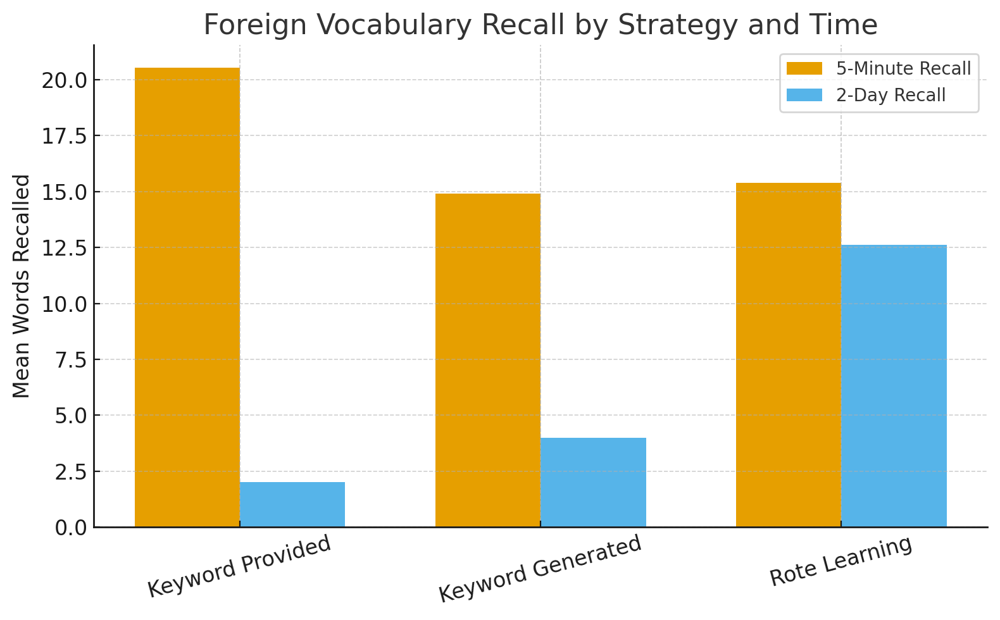

# foreign-vocabulary-recall-analysis
# 🧠 Foreign Vocabulary Recall Analysis   ### Experimental Design &amp; Two-Way ANOVA (SPSS)

> Applied two-way ANOVA to examine how encoding strategy and recall interval influence memory for foreign vocabulary.  
> A data-driven exploration of learning strategies, recall patterns, and effect size interpretation.

---

## 📚 Study Overview  
Thomas & Wang (1996) investigated how **mnemonic strategies** affect the recall of Tagalog vocabulary words. Participants learned 26 Tagalog words using one of three strategies:

- **Keyword Generated** – participants created their own mnemonic keywords.  
- **Keyword Provided** – experimenters provided mnemonic keywords.  
- **Rote Learning** – participants memorized word meanings through repetition.  

They were tested after either **5 minutes** or **2 days** to assess retention over time.  

---

## 🔬 Research Design  
- **Design:** 3 (Strategy) × 2 (Recall Time) Between-Subjects ANOVA  
- **Dependent Variable:** Number of words recalled  
- **Software:** IBM SPSS Statistics  

---

## 🧩 Results  

| Source | F | p | η² | Interpretation |
|--------|---|---|----|----------------|
| Strategy | 7.227 | .001 | .018 | Significant main effect — encoding strategy influences recall |
| Recall Time | 119.837 | < .001 | .149 | Highly significant — recall decreases sharply over time |
| Strategy × Recall Time | 21.523 | < .001 | .053 | Significant interaction — strategy effectiveness depends on recall delay |

---

## 🧮 Effect Sizes (Eta Squared)
- **Strategy:** η² = .018 → 1.8% of variance explained  
- **Recall Time:** η² = .149 → 14.9% of variance explained  
- **Interaction:** η² = .053 → 5.3% of variance explained  

These values indicate a **large effect** of recall time, and moderate effects of strategy and interaction.

---

## 📊 Results Visualization

**Figure 1.** Mean number of Tagalog words recalled across encoding strategies and recall intervals.

- At **5-minute recall**, participants using the **Keyword Provided** strategy remembered the most words, showing the short-term benefit of dual-coding (visual + verbal).  
- After **2 days**, the **Rote Learning** group retained more words than both keyword groups, suggesting that repetition may support longer-term retention once mnemonic imagery fades.  

This visual reinforces the significant **Strategy × Recall Time interaction**, demonstrating that the most effective learning technique depends on the time elapsed before recall.

---

## 🧠 Simple Effects Analysis  

### 5-Minute Recall
- **Keyword Provided:** M = 20.54, SD = 1.98  
- **Keyword Generated:** M = 14.92, SD = 5.33  
- **Rote Learning:** M = 15.38, SD = 5.45  

> Participants recalled significantly more words when mnemonic keywords were provided by the experimenter.

### 2-Day Recall
- **Rote Learning:** M = 12.62, SD = 6.49  
- **Keyword Generated:** M = 4.00, SD = 2.52  
- **Keyword Provided:** M = 2.00, SD = 1.47  

> After 2 days, rote learning outperformed keyword methods, suggesting that short-term mnemonic benefits may fade with time.

---

## 🗒️ APA Summary
A two-way ANOVA revealed significant main effects of **strategy**, F(2, 72) = 7.227, p = .001, η² = .018,  
and **recall time**, F(1, 72) = 119.837, p < .001, η² = .149,  
as well as a significant **interaction**, F(2, 72) = 21.523, p < .001, η² = .053.  
These findings indicate that both learning strategy and recall interval significantly affect memory performance, and their effects interact.

---

## 🧩 Skills Demonstrated
- 🧪 Statistical Analysis (Two-Way ANOVA, SPSS)
- 📊 Effect Size Computation (η²)
- 🧩 Interaction Interpretation
- ✏️ APA-Style Scientific Writing
- 🧠 Cognitive & Learning Psychology Application

---

## ✏️ Author  
**Fernando (Fern) Gutierrez**  
Data-driven storyteller exploring the psychology behind learning and recall.  
[LinkedIn](https://www.linkedin.com/in/fernando-gutierrez/) • [GitHub](https://github.com/Ferniverse)

---
